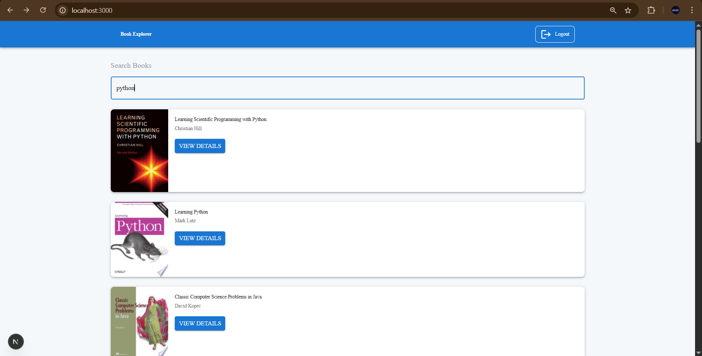
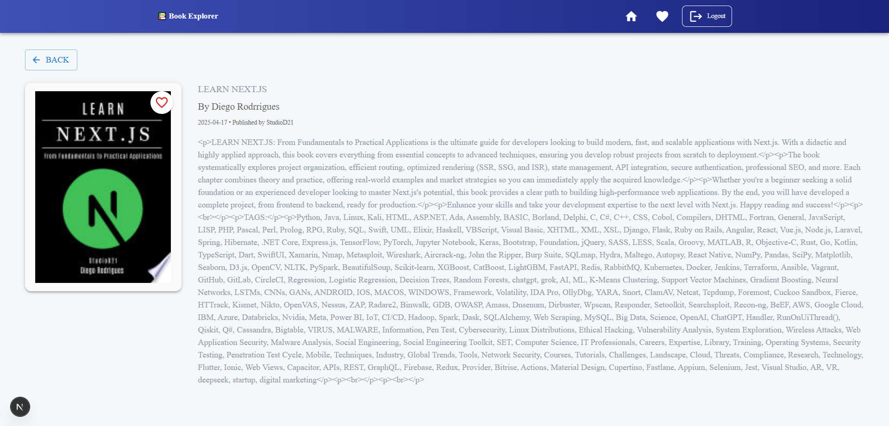
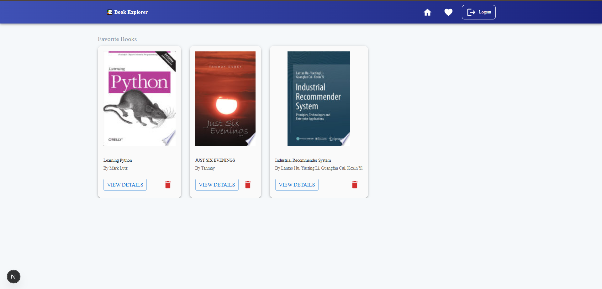

# 📚 Book Explorer

A modern web app built with **Next.js**, **TypeScript**, **React Query**, and **Firebase Auth** that allows users to **search books**, view detailed book info, and **save favorites**.

---

## 🚀 Features

- 🔍 Search books using [Google Books API](https://developers.google.com/books)
- 📖 View detailed book info (authors, description, image, etc.)
- ❤️ Add books to your **favorites**
- 🔐 Login & Signup with **Firebase Authentication**
- ⚡ Fast and optimized using **React Query**
- 🎨 Beautiful UI using **Material UI (MUI)**

---

## 🧪 Tech Stack

- **Framework**: [Next.js](https://nextjs.org/)
- **Language**: TypeScript
- **UI**: Material UI
- **Data Fetching**: React Query
- **Authentication**: Firebase Auth
- **Database**: Firestore (for storing favorites)

---

## 🖼️ Screenshots

| Search | Book Details | Favorites |
|--------|---------------|-----------|
|  |  |  |

---

## 🔧 Setup Instructions

### 1. Clone the repo

```bash
git clone https://github.com/TanmayShil/Book-Explorer-Next-Firebase-GoogleBooksAPI-ReactQuery.git
cd book-explorer
```
---


